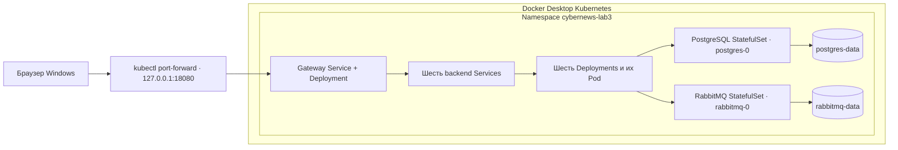

# Архитектура

```mermaid
flowchart LR
    B["Браузер Windows"]
    F["kubectl port-forward · 127.0.0.1:18080"]
    B --> F
    subgraph K["Docker Desktop Kubernetes"]
        subgraph N["Namespace cybernews-lab3"]
            G["Gateway Service + Deployment"]
            S["Шесть backend Services"]
            A["Шесть Deployments и их Pod"]
            P["PostgreSQL StatefulSet · postgres-0"]
            R["RabbitMQ StatefulSet · rabbitmq-0"]
            V1[("postgres-data")]
            V2[("rabbitmq-data")]
            G --> S --> A
            A --> P --> V1
            A --> R --> V2
        end
    end
    F --> G
```

[Развёртывание и проверка](../README.md)
