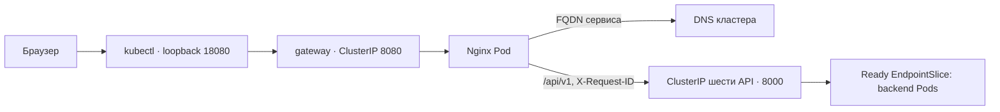

# Сеть

```mermaid
flowchart LR
    U["Браузер"]
    K["kubectl · loopback 18080"]
    S["gateway · ClusterIP 8080"]
    P["Nginx Pod"]
    D["DNS кластера"]
    A["ClusterIP шести API · 8000"]
    T["Ready EndpointSlice: backend Pods"]
    U --> K --> S --> P
    P -->|"FQDN сервиса"| D
    P -->|"/api/v1, X-Request-ID"| A --> T
```

[Развёртывание и проверка](../README.md)
