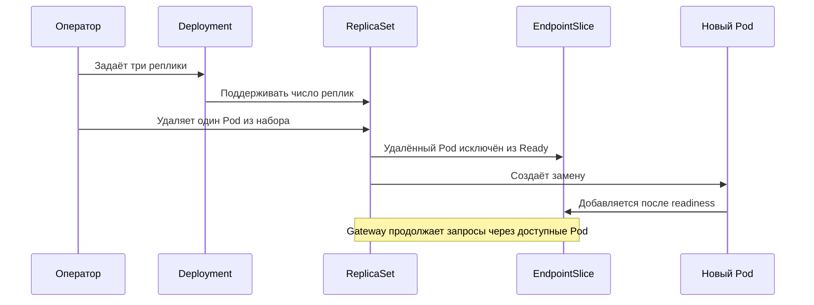

# Восстановление

```mermaid
sequenceDiagram
    participant O as Оператор
    participant D as Deployment
    participant S as ReplicaSet
    participant E as EndpointSlice
    participant P as Новый Pod
    O->>D: Задаёт три реплики
    D->>S: Поддерживать число реплик
    O->>S: Удаляет один Pod из набора
    S->>E: Удалённый Pod исключён из Ready
    S->>P: Создаёт замену
    P->>E: Добавляется после readiness
    Note over S,E: Gateway продолжает запросы через доступные Pod
```

[Развёртывание и проверка](../README.md)
