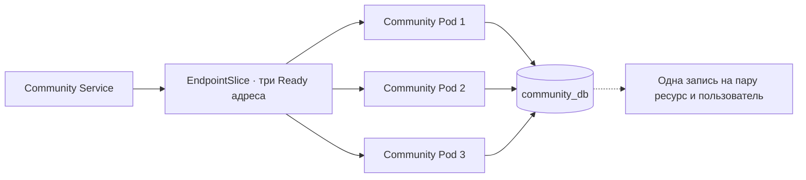

# Масштабирование

```mermaid
flowchart LR
    S["Community Service"]
    E["EndpointSlice · три Ready адреса"]
    S --> E
    E --> C1["Community Pod 1"]
    E --> C2["Community Pod 2"]
    E --> C3["Community Pod 3"]
    C1 & C2 & C3 --> D[("community_db")]
    D -.-> A["Одна запись на пару ресурс и пользователь"]
```

[Развёртывание и проверка](../README.md)
