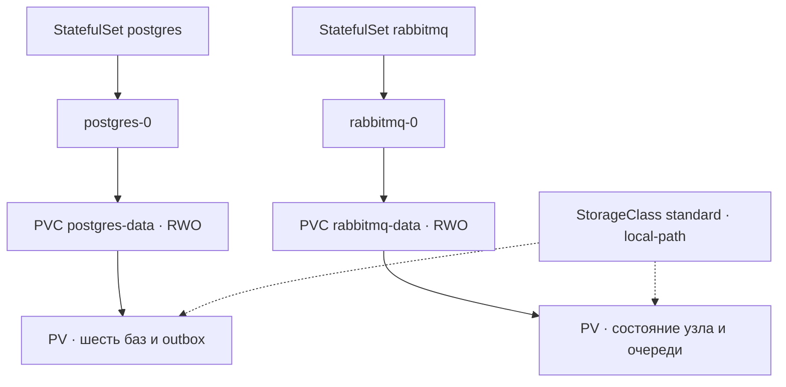

# Хранилище

```mermaid
flowchart TB
    S1["StatefulSet postgres"] --> P1["postgres-0"]
    S2["StatefulSet rabbitmq"] --> P2["rabbitmq-0"]
    P1 --> C1["PVC postgres-data · RWO"]
    P2 --> C2["PVC rabbitmq-data · RWO"]
    C1 --> V1["PV · шесть баз и outbox"]
    C2 --> V2["PV · состояние узла и очереди"]
    X["StorageClass standard · local-path"]
    X -.-> V1
    X -.-> V2
```

[Развёртывание и проверка](../README.md)
